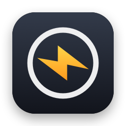
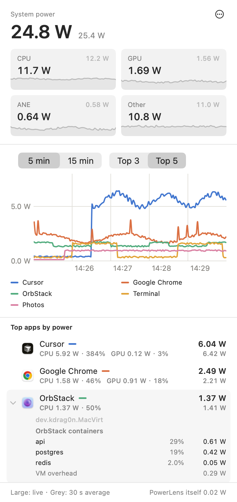

# PowerLens - Mac Power Monitor

<p>
  <a href="README.md"></a>
  <a href="README.zh-CN.md"></a>
</p>

PowerLens is a menu-bar app for Apple Silicon Macs. It shows the power draw of each app, split into CPU, GPU and Neural Engine, together with the total system power. You can use it to see which processes use the most energy, for example background automation, AI agents or containers.

<p align="center">
  <picture>
    <source media="(prefers-color-scheme: dark)" srcset="docs/images/panel-dark.png">
    
  </picture>
  <br>
  <sub>Screenshot rendered with sample data.</sub>
</p>

## Features

- **System power** from the Mac's built-in power sensor, broken down into CPU, GPU, Neural Engine (ANE) and Other. Each tile draws the last minute as a small curve.
- **Power per app**, grouped the way Activity Monitor groups apps. Helpers, XPC services and command-line tools launched by an app count toward that app.
- **Chart of the top 3 or 5 apps** over the last 5 or 15 minutes. Each app keeps its color while it stays on the chart.
- **Top 10 list.** Click an app to see its child processes with their command lines and working directories. OrbStack and Docker Desktop also show each container.
- **Sleep blockers**: the processes currently keeping your Mac awake.
- **Resource use**: PowerLens runs with normal user permissions, reads all data locally and keeps its history in memory. The footer shows its own power use, about 0.001 W while the panel is closed.
- Interface in English and Simplified Chinese.

## Reading the panel

- **Large numbers are live**: the latest sample, taken every second while the panel is open. **Small grey numbers are 30-second averages.** The footer says this once, which keeps the rest of the panel clean.
- Each number is the exact average over its interval. The kernel counters PowerLens reads keep adding up, and any short spike between two samples is part of the result.
- **Other** is system power minus CPU, GPU and ANE. It covers the display backlight, memory, storage, Wi-Fi and Bluetooth, bus-powered accessories, media engines, shared chip logic, idle cores, power conversion losses and fans.
- The list is sorted by the 30-second average, which keeps rows from jumping around every second.
- **Exited processes** in an expanded row is the energy used by short-lived child processes that finished during the interval. The kernel keeps counting it under their app.

## Requirements

- A Mac with Apple Silicon
- macOS 14 Sonoma or later

PowerLens was built and validated on an M5 Pro running macOS 27. The same data sources exist on earlier chips and macOS versions, though they haven't been checked there yet. If you try it on other hardware, please open an issue and tell us how it went, especially if the numbers look off.

## Install

### Download

1. Download `PowerLens-<version>.zip` from the [latest release](https://github.com/DongkunXu/PowerLens-Mac-Power-Monitor/releases/latest) and unzip it.
2. Move `PowerLens.app` to Applications.
3. Open it. macOS blocks the first launch because the app isn't notarized by Apple (notarization requires a paid developer account). To allow it, pick one:
   - Go to **System Settings → Privacy & Security**, scroll to the message about PowerLens, click **Open Anyway** and confirm.
   - Run this in Terminal: `xattr -dr com.apple.quarantine /Applications/PowerLens.app`

   All the source code is in this repository if you'd like to read it or build the app yourself.
4. Click the PowerLens icon (a bolt in a circle) in the menu bar.

### Build from source

You need an Apple Silicon Mac with Xcode 26 (Swift 6).

```bash
git clone https://github.com/DongkunXu/PowerLens-Mac-Power-Monitor.git
cd PowerLens-Mac-Power-Monitor
scripts/build-app.sh --install   # builds, installs to /Applications and launches
```

## Settings

Open the **⋯** menu in the top-right corner of the panel:

- **Launch at Login**
- **Appearance**: System, Light or Dark
- **Language**: English or 简体中文, switches right away
- **Quit PowerLens**

## Privacy

- PowerLens reads kernel counters and the power sensor on your Mac. It never connects to the internet.
- When OrbStack or Docker Desktop is already running, PowerLens asks its local Docker socket for container stats. A stopped runtime stays stopped.
- History stays in memory in rolling windows: about 16 minutes for the chart and 60 seconds for the tile curves. Older data is dropped as it ages. The only thing PowerLens writes to disk is your settings.
- It runs with normal user permissions and never asks for an administrator password.

## Uninstall

If you built from source, run `scripts/uninstall.sh`. It removes the app, its login item, settings and caches.

If you installed from a release:

1. In the ⋯ menu, turn off **Launch at Login** and choose **Quit PowerLens**.
2. Delete `PowerLens.app` from Applications.
3. To remove the settings too, run `defaults delete io.github.dongkunxu.PowerLens`.

## How it works

macOS keeps energy counters for every resource coalition, the same grouping Activity Monitor uses to combine processes by app. PowerLens reads these counters together with the SMC's system power sensor, once a second while the panel is open and every 3 seconds while it's closed, and turns the difference between two readings into watts.

[docs/MEASUREMENT.md](docs/MEASUREMENT.md) covers the data sources, the ones that were tried and dropped, how the numbers were checked against hardware counters, and the known limitations.

## Limitations

- Apple Silicon only. PowerLens uses undocumented kernel interfaces and SMC keys. That keeps it out of the App Store, and a future macOS update could change them. `scripts/validate.sh` re-checks the data sources.
- The number for an app is the energy the kernel bills to that app. Shared costs, like waking a CPU cluster or running the memory fabric, belong to no single app and show up under **Other**.
- Per-process details are available for your own processes. Processes owned by other users, such as root, are counted in their app's total.
- Container numbers are estimates. PowerLens measures the virtual machine's energy and splits it between containers by their share of CPU time. This is verified with OrbStack. Docker Desktop support is written and still waiting to be verified.

## Contributing

Bug reports and pull requests are welcome. [CONTRIBUTING.md](CONTRIBUTING.md) covers building, testing, validation, the code layout and adding a language.

## License

[MIT](LICENSE) © 2026 Dongkun Xu
