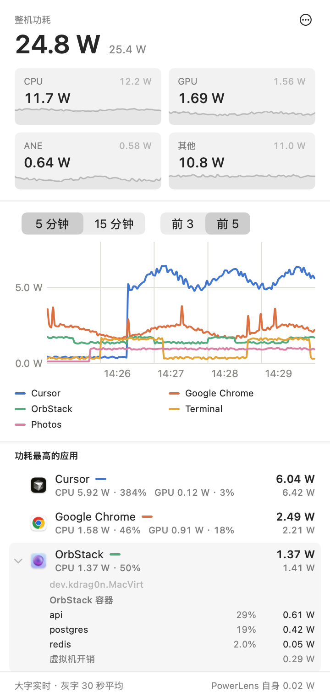

# PowerLens - Mac Power Monitor

<p>
  <a href="README.md"></a>
  <a href="README.zh-CN.md"></a>
</p>

PowerLens 是一个适用于 Apple Silicon Mac 的菜单栏工具。它按 app 显示功耗，分为 CPU、GPU 和神经网络引擎三部分，同时显示整机功耗。可以用来查看哪些进程耗电最多，比如后台自动化任务、AI agent 或容器。

<p align="center">
  <picture>
    <source media="(prefers-color-scheme: dark)" srcset="docs/images/panel-zh-Hans-dark.png">
    
  </picture>
  <br>
  <sub>截图使用示例数据渲染。</sub>
</p>

## 功能

- **整机功耗**：来自 Mac 自带的功率传感器，拆成 CPU、GPU、神经网络引擎（ANE）和其他四项，每一项的背景是最近一分钟的小曲线。
- **每个 app 的功耗**：分组方式和活动监视器一样，app 的辅助进程、XPC 服务和它启动的命令行程序都算在它名下。
- **功耗前 3 或前 5 的 app 曲线**，可以看最近 5 分钟或 15 分钟。app 留在图上时颜色一直不变。
- **前 10 名列表**：点开一个 app，可以看到它的子进程、命令行和工作目录。OrbStack 和 Docker Desktop 还能看到每个容器。
- **阻止睡眠的程序**：现在是哪些进程让 Mac 保持唤醒。
- **资源占用**：以普通用户权限运行，数据都在本机读取，历史只保存在内存里。面板底部显示它自身的功耗，面板关闭时约 0.001 W。
- 界面有英文和简体中文两种。

## 怎么看面板

- **大字是实时值**，也就是最近一次采样，面板打开时每秒更新一次。**灰色小字是 30 秒平均。**这条说明只在底栏写一次，面板其他地方保持清爽。
- 每个数字都是这段时间的精确平均。PowerLens 读的内核计数器一直在累加，两次采样之间出现的短暂峰值也会算进去。
- **其他** = 整机功耗减去 CPU、GPU 和 ANE，包括屏幕背光、内存、存储、Wi-Fi 和蓝牙、从接口取电的外设、视频编解码、芯片公共部分、空闲核心、电源转换损耗和风扇。
- 列表按 30 秒平均排序，行的顺序每秒都保持稳定。
- 展开某一行后看到的**已退出的子进程**，是这段时间里已经结束的短命子进程用掉的能量，内核会继续把它记在所属 app 名下。

## 系统要求

- 搭载 Apple Silicon 的 Mac
- macOS 14 Sonoma 或更新版本

PowerLens 是在 M5 Pro、macOS 27 上开发和验证的。更早的芯片和 macOS 版本上也有同样的数据源，只是还没实际验证过。如果你在其他机型上用了，欢迎开个 issue 说说情况，数字看着不对的时候尤其欢迎。

## 安装

### 下载安装

1. 从[最新版本](https://github.com/DongkunXu/PowerLens-Mac-Power-Monitor/releases/latest)下载 `PowerLens-<版本号>.zip` 并解压。
2. 把 `PowerLens.app` 拖进「应用程序」。
3. 打开它。这个 app 没有经过 Apple 公证（公证需要付费开发者账号），第一次打开会被系统拦下。放行方法二选一：
   - 打开「**系统设置 → 隐私与安全性**」，往下找到 PowerLens 的提示，点「**仍要打开**」并确认。
   - 在终端运行：`xattr -dr com.apple.quarantine /Applications/PowerLens.app`

   完整源码就在这个仓库里，想先看代码或者自己编译都可以。
4. 点菜单栏里的 PowerLens 图标（圆圈里一道闪电）。

### 从源码编译

需要一台 Apple Silicon Mac 和 Xcode 26（Swift 6）。

```bash
git clone https://github.com/DongkunXu/PowerLens-Mac-Power-Monitor.git
cd PowerLens-Mac-Power-Monitor
scripts/build-app.sh --install   # 编译、安装到 /Applications 并启动
```

## 设置

点面板右上角的 **⋯**：

- **开机启动**
- **外观**：跟随系统、浅色或深色
- **语言**：English 或简体中文，选完马上生效
- **退出 PowerLens**

## 隐私

- PowerLens 只在你的 Mac 上读取内核计数器和功率传感器，从不连接互联网。
- OrbStack 或 Docker Desktop 已经在运行时，PowerLens 会通过本机的 Docker 套接字读取容器统计。停着的运行时会一直保持停止状态。
- 历史数据按窗口滚动保存在内存里：曲线图大约 16 分钟，方块背景曲线 60 秒，旧数据随时丢弃。PowerLens 写到磁盘上的只有你的设置。
- 它以普通用户权限运行，从不索要管理员密码。

## 卸载

从源码编译安装的，运行 `scripts/uninstall.sh` 就行，它会删掉 app、登录项、设置和缓存。

下载安装的：

1. 在 ⋯ 菜单里关掉「**开机启动**」，再选「**退出 PowerLens**」。
2. 从「应用程序」里删掉 `PowerLens.app`。
3. 想把设置也删掉，就运行 `defaults delete io.github.dongkunxu.PowerLens`。

## 工作原理

macOS 为每个 resource coalition 记录能耗计数器，活动监视器按 app 合并进程用的就是这种分组。PowerLens 读取这些计数器和 SMC 的整机功率传感器，面板打开时每秒读一次，关着时每 3 秒读一次，再把两次读数的差换算成瓦数。

数据来源、试过又放弃的来源、怎样用硬件计数器验证这些数字，以及已知限制，都写在 [docs/MEASUREMENT.md](docs/MEASUREMENT.md)（英文）里。

## 限制

- 只支持 Apple Silicon。PowerLens 用到了未公开的内核接口和 SMC 键值，上不了 App Store，以后的 macOS 更新也可能改掉它们。可以用 `scripts/validate.sh` 重新检查数据源。
- app 的数字是内核记在这个 app 名下的能耗。唤醒 CPU 簇、片上互联这类公共开销归不到哪一个 app，会算进「**其他**」。
- 逐进程明细只能看你自己的进程。其他用户（比如 root）的进程会计入所属 app 的总数。
- 容器的数字是估算值。PowerLens 实测虚拟机的能耗，再按各容器的 CPU 时间占比分给它们。这部分在 OrbStack 上验证过，Docker Desktop 的支持已经写好，还在等验证。

## 参与贡献

欢迎提 issue 和 Pull Request。编译、测试、验证、代码结构和添加新语言的方法见 [CONTRIBUTING.md](CONTRIBUTING.md)（英文）。

## 许可证

[MIT](LICENSE) © 2026 Dongkun Xu
